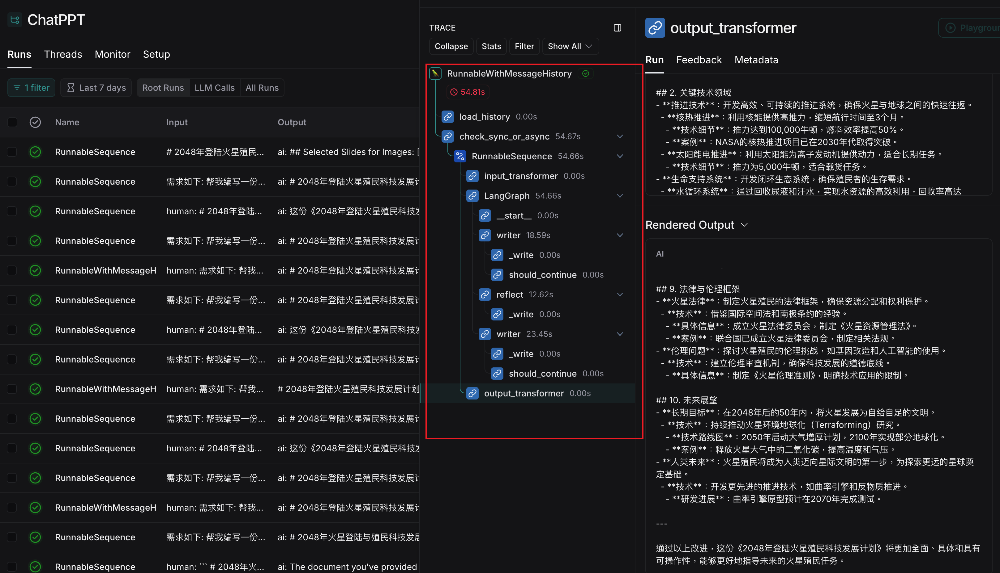

# 作业要求

1. 集成图像生成模型：在搜索引擎的检索质量不高时，使用 SD 或其他文生图模型，为 PowerPoint 智能配图。
2. 使用 LangGraph 反思机制，通过 3-7 轮对话提升 ChatBot 生成质量或内容深度，再给到用户反馈。同时，ChatHistory 适配仅保留最终生成版本。
3. 使用 Streamlit 或其他前端框架，将 ChatPPT 已经集成的 Whisper， MiniCPM 等模型通过更强的交互能力，便捷地提供给用户。

# 作业提交

## 修改的关键代码

- [src/chatbot.py](../src/chatbot.py#L43)
- [src/writer_and_reflect_agent.py](../src/writer_and_reflect_agent.py)
- [src/gradio_server.py](../src/gradio_server.py)

## 结果展示

[生成的 pptx 链接](./result.pptx)