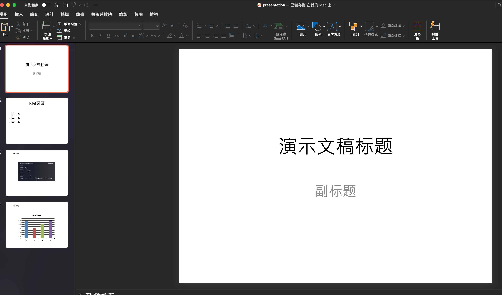
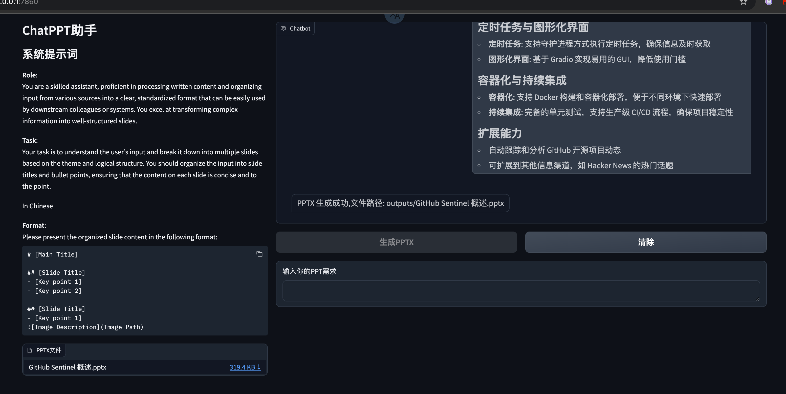
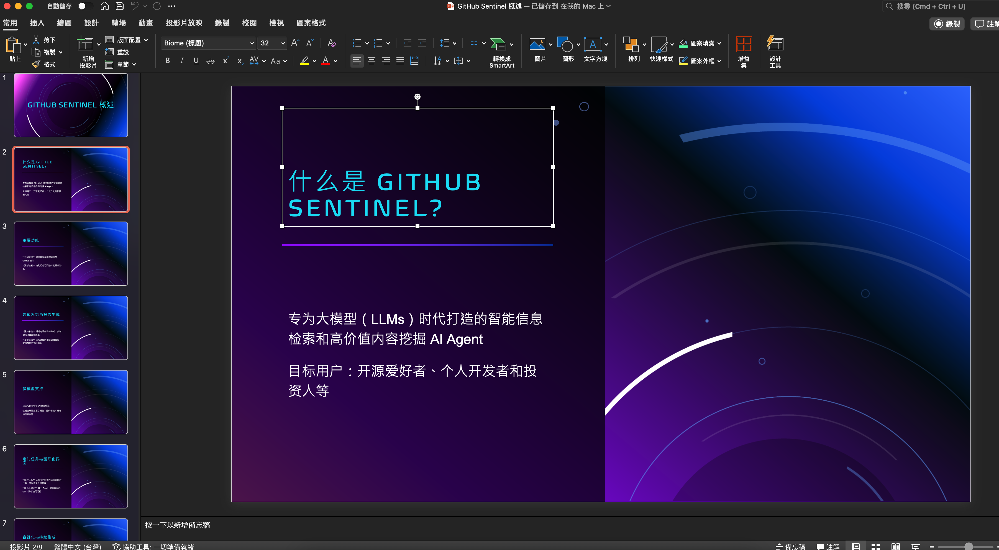

# 作业要求

1. 使用 python-pptx 自动生成 PowerPoint 文件，内容包括文本、图片、表格和图表 。

2. 使用 Gradio 搭建一个 ChatBot 作为图形化用户界面（GUI），支持将用户输入转换为 ChatPPT PowerPoint 标准输入格式（Markdown），并最终生成 PowerPoint 文件。

    - ChatBot System Prompt 可使用 ChatPPT v0.2 prompts/formatter.txt 文件，鼓励自行创作和优化。
    - 【可选】将 ChatBot 生成 Markdown 和 ChatPPT v0.2 的主流程整合，支持聊天输入，自动生成 PowerPoint 文件作为输出。

## 作业实现

1. 使用 python-pptx 自动生成 PowerPoint 文件，内容包括文本、图片、表格和图表 。

- [手动生成 pptx 代码跳转 create_pptx.py](./create_pptx.py)
- [手动生成 pptx 文件跳转 ppt/presentation.pptx](./ppt/presentation.pptx)

效果展示：

1. 使用 Gradio 搭建一个 ChatBot 作为图形化用户界面（GUI），支持将用户输入转换为 ChatPPT PowerPoint 标准输入格式（Markdown），并最终生成 PowerPoint 文件。
【可选】将 ChatBot 生成 Markdown 和 ChatPPT v0.2 的主流程整合，支持聊天输入，自动生成 PowerPoint 文件作为输出。

- [ChatBot 的代码跳转 gradio_chatbot_ppt.py](../src/gradio_chatbot_ppt.py)
- [main.py 重构了一个 generate_pptx_from_markdown 函数 <-- 跳转](../src/main.py#L24)
- [生成的 pptx 文件《GitHub Sentinel 概述.pptx》 跳转](./ppt/GitHub%20Sentinel%20概述.pptx)

效果展示：

 

