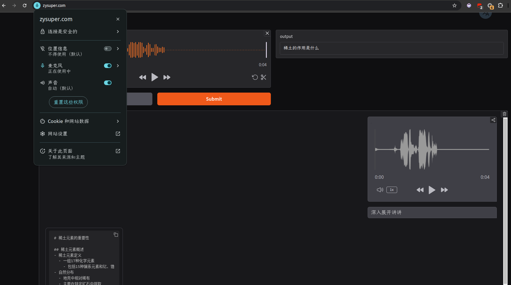

# 作业要求

1. 将 ChatPPT 发布为 HTTPS 服务（IP：PORT 形式访问），提交截图。
2. 【可选】使用你的域名来发布 ChatPPT 服务，提交服务链接。

# 作业提交

1. 使用 mkcert 生成证书，并配置 nginx 使用证书。【开发环境测试使用】

mkcert 证书生成过程：

```bash
mkcert -install
mkcert zysuper.com "*.zysuper.com" 172.22.0.2
```



- [docker-compose.yml 配置](docker-compose.yml)
- [nginx.conf 配置](nginx.conf)
- [Dockerfile 配置](Dockerfile)
- [pptx 文件](稀土元素的重要性.pptx)

1. TODO:: 不太安全，还是算了

