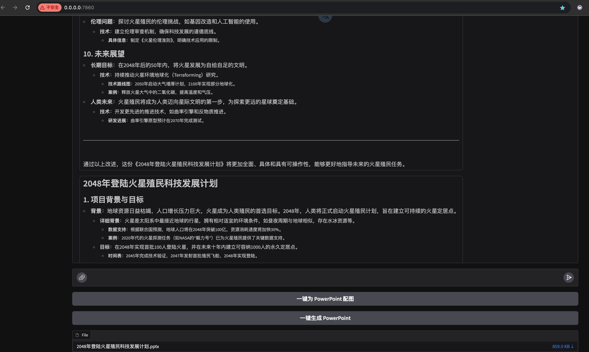

# 作业要求

以下三个作业任选一个完成即可：

1. 集成图像生成模型：在搜索引擎的检索质量不高时，使用 SD 或其他文生图模型，为 PowerPoint 智能配图。
2. 使用 LangGraph 反思机制，通过 3-7 轮对话提升 ChatBot 生成质量或内容深度，再给到用户反馈。同时，ChatHistory 适配仅保留最终生成版本。
3. 使用 Streamlit 或其他前端框架，将 ChatPPT 已经集成的 Whisper， MiniCPM 等模型通过更强的交互能力，便捷地提供给用户。

# 作业提交

**选择第二个作业完成**

## 修改的关键代码

```python
        # 创建 graph 并将其包装为 runnable
        graph = make_graph(writer_prompt, reflection_prompt)

        # 将 input_transformer 和 output_transformer 应用到 graph 上
        self.chatbot = input_transformer | graph | output_transformer
        ...
```

- [src/chatbot.py](../src/chatbot.py#L43)
- [src/writer_and_reflect_agent.py](../src/writer_and_reflect_agent.py)
- [src/gradio_server.py](../src/gradio_server.py)

## 结果展示




[生成的 pptx 链接](./result.pptx)